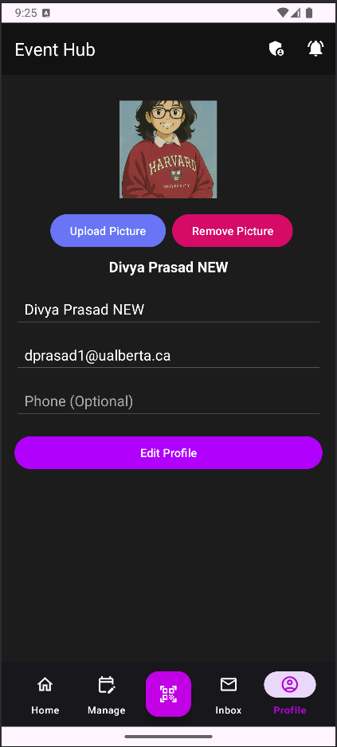

# Demo Video
https://www.youtube.com/watch?v=DIWl9pOFmR0

# EventHub
A mobile app designed to simplify event management by allowing users to both organize and attend events of all types. The app enables organizers to easily set up details such as event name, date, time, location, and description, while also managing RSVPs and participant lists. Attendees can browse upcoming events, join by scanning a QR code, and receive real-time updates or reminders. Whether it’s for small meetups, large conferences, or casual social events, the app streamlines the entire process—making it more convenient for people to connect, engage, and participate.

# User Interface
<div style="display:flex; gap:10px;">
  
  
  
</div>

# Technologies Used
- Java
- JUnit (for testing)
- Android Studio
- Places API for the geolocation feature
- Firestore Database (noSQL)

# Installation
1. Get an API key: https://cloud.google.com/free/docs/free-cloud-features
2. Clone the repo
   ```sh
   git clone https://github.com/EventHubApp/Event-Hub.git
   ```
3. Enter your API in 'local.properties':
```js
   MAPS_API_KEY = 'ENTER YOUR API';
   ```

# Challenges We Faced
- Balancing real-time updates for attendees (e.g., last-minute event changes) while keeping the app lightweight and responsive.
- Designing a user interface that was intuitive for both organizers and participants, since their needs were quite different.
- Implementing Firestore database queries efficiently to avoid slow loading times when retrieving large sets of event data.

# Accomplishments We Are Proud Of
- Built a fully functional event management system where users could seamlessly create, browse, and join events.
- Integrated notification features, ensuring users never missed important updates.
- Implemented role-based features (organizer vs attendee), which made the app scalable for both personal and community events.
- Created a clean, responsive UI designed for Android

# What We Learned
- The importance of designing with scalability in mind
- Optimize database queries and manage client-side state effectively in mobile development.
- The value of user testing to catch pain points early, especially in UI/UX.
- That clear team communication and breaking work into smaller tasks helped us stay on track and deliver on time.
